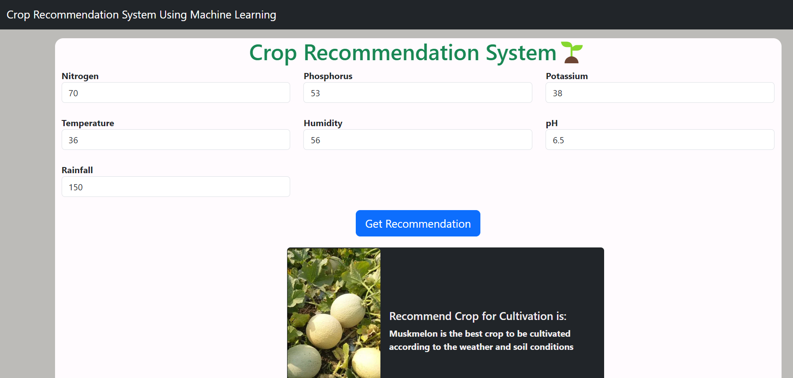

# Crop Recommendation System

This Flask web application recommends the best crop to cultivate based on given environmental conditions such as
Nitrogen, Phosphorus, Potassium levels, temperature, humidity, pH, and rainfall. It utilizes a pre-trained
RandomForestClassifier model to make predictions.


## Features

- Input environmental conditions via a web form.
- Predict the best crop to cultivate based on the inputs.
- Display the result on the web page.

## Requirements

- Python 3.6+
- Flask
- NumPy
- Pandas
- Scikit-learn
- Pickle

## Installation

1. Clone the repository:

```bash
git clone https://github.com/your-username/crop-recommendation-system.git
cd crop-recommendation-system

2. Create a virtual environment and activate it:
```bash
python -m venv venv
source venv/bin/activate # On Windows, use `venv\Scripts\activate`


3. Install the required packages:
```bash
pip install -r requirements.txt

4. Ensure you have the model and scaler files ('model.pkl', 'minmaxscaler.pkl', 'standscaler.pkl') in the root
directory.

## Usage

1. Run the Flask application:
Run the Flask application:
```bash
python app.py

2. Open your web browser and navigate to http://127.0.0.1:5000.

3. Enter the environmental conditions and click the "Submit" button to get the crop recommendation.

### Steps to Follow:

1. **Clone the Repository**: Provide the link to your GitHub repository.
2. **Create and Activate Virtual Environment**: Instruct users to create and activate a virtual environment.
3. **Install Requirements**: Make sure to include a `requirements.txt` file with all the necessary dependencies. You can generate this file using `pip freeze > requirements.txt`.
4. **Ensure Model and Scaler Files**: Specify that the model and scaler files should be in the root directory.
5. **Run the Application**: Instructions to run the Flask app and access it via a web browser.
6. **File Structure**: Provide an overview of the key files and directories.
7. **License and Acknowledgments**: Add any relevant licensing information and credits.
8. **Contact Information**: Include your contact information for further questions or suggestions.

Make sure to adjust paths, repository links, and contact details as needed. Additionally, create an `index.html` file under the `templates` directory to ensure the web interface works correctly.


## License

This project is licensed under the MIT License. See the `LICENSE` file for details.

## Acknowledgements
- This application was developed as part of a crop recommendation project using machine learning.
